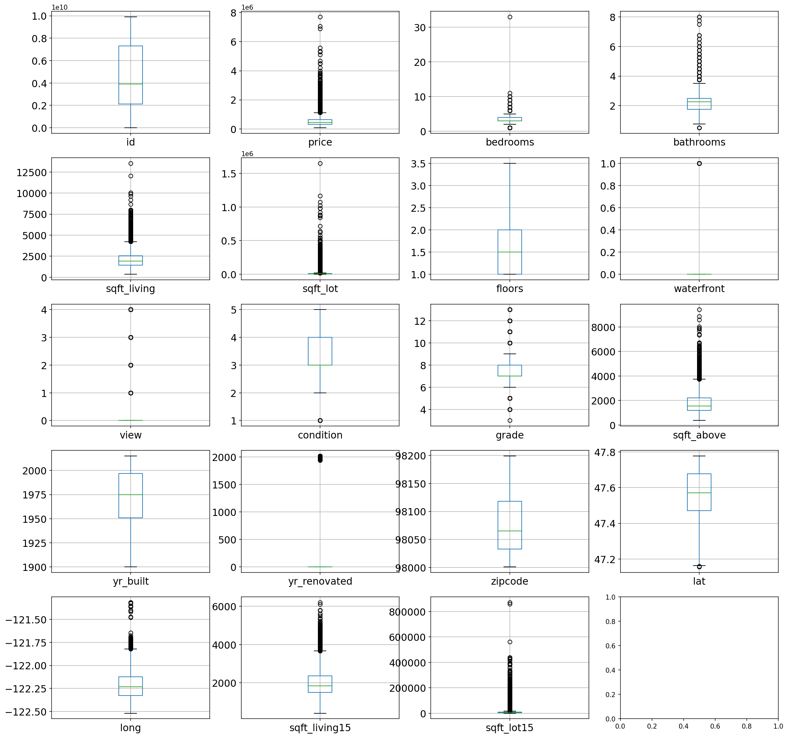
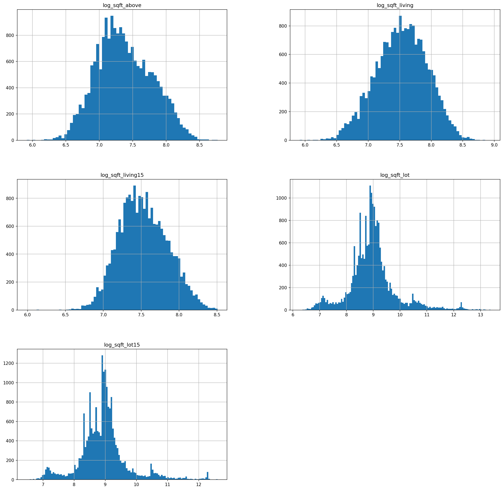
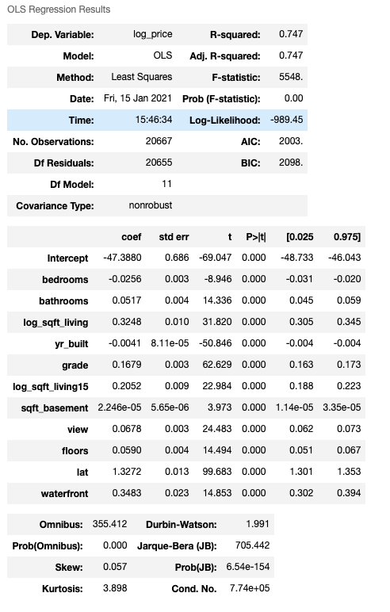
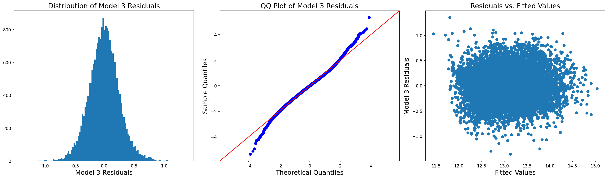
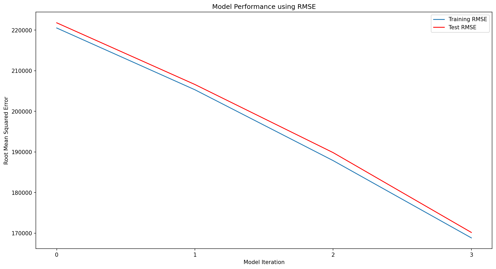

# Understanding the Housing Market in King County, WA

## Author: [Patricio Contreras](https://www.linkedin.com/in/pcontreras97/)

## Overview
----------------
This project is concerned in providing data-driven insights of the current housing market in King County, WA.  The first half will focus on exploratory analysis such as descriptive statistics and visualisations in order to understand the data and get a good read of the market.  The second half utilises what is learnt and uses regression modelling to assist real estate agents and prospective house owners predict future house prices.

## Business Problem
--------------------------
Up and coming real estate agent Franklin Bluth is ready to get out there and start selling houses!  However, before doing that, Franklin believes that in order to become the best real estate agent in Washington State, a thorough analysis of the current housing market is in need.  He thinks exploratory analysis isn't enough to gain a major advantage over everyone else and therefore would also like to develop a model to predict housing prices based on existing features.

## The Data
---------------
This project uses the King County House Sales dataset found in the [data](data) folder.  It includes home sold between May 2014 and May 2015 in Seattle and the neighbouring areas within King County.  For more information about this dataset, please visit [Kaggle](https://www.kaggle.com/harlfoxem/housesalesprediction).

## Methods
---------------
The work done in this project mostly follows the Cross-Industry Standard Process for Data Mining (CRISP-DM) in that we begin with data understanding and exploratory data analysis, prepare/clean the data, construct a predictive model using the cleaned data, evaluate it, and decide if we should repeat the process or are satisfied with deployment.

## CRISP-DM
-----------------
### Data Understanding

It was clear from the beginning that some variables needed to be transformed and cleaned due to their skewness and outliers:

### Data Preparation

In addition to accounting for missing values and incorrect data types, an important part of this stage was to transform some of the variables to approach normal distributions:

### Modeling

After performing several iterations in which I transformed variables, included/excluded variables, and reviewed the assumptions for multiple linear regression, the final predictive model chosen has the following traits:

As seen above, several predictor variables were log-transformed (including the response) and all of the independent variables used in the model were deemed significant (p-value < 0.05).  An R-squared of 0.747 indicates that 74.7% of the variance in the response variable is explained by the model.

After fitting, the models were evaluated by inspecting their residuals and performing 5-fold cross validation.  This way we not only assess how our model performs with our data, but also get an idea of how it fares with unseen data:

The plots shown above suggest the model *does* follow the residual assumptions of normality, constant spread, and mean of 0.  The last step of the evaluation process was cross validation where training and test mean squared errors were obtained.  The following shows *root* mean squared error as this is more intuitive:

As seen above, transformations and increasing model complexity helped decrease the root mean squared error significantly.  In other words, this shows that with each model iteration, the *residual standard deviation* shrunk in both the training and test scenarios.

## Final Model Summary

**log(price) = -47.39-0.03(bedrooms)+0.05(bathrooms)+0.33log(sqft_living)-0.004(yr_built)+0.17(grade)+...**

After creating 4 different models for this dataset, I believe Model 3 does the best job at fitting the data and meeting the regression assumptions.  Despite somewhat violating the linear relationship regression assumption, Model 3 meets the residual and multicollinearity assumptions pretty well.  Also, the number of predictors is reasonable (not too much which would possibly overfit the data, and not too few which would lead to a low R-squared and underfitting the data).  It is also important to note that all the predictors in Model 3 were deemed "significant" which means they *do* have an impact on the response variable: log(`price`).

### Interpreting Beta Coefficients

Without going into each of the 10 predictor variables, here is the interpretation of the beta coefficient for 3 of them:

- `grade`: one unit increase in `grade` is associated with a 16.79% increase in `price`

- `log_sqft_living`: one percent increase in `sqft_living` is associated with a 0.33% increase in `price`

- `floors`: one unit increase in `floors` is associated with a 5.9% increase in `price`

## Future Work

Even though this project dealt with creating regression models through an iterative process of constantly evaluating and tweaking variables, there are still *plenty* of other changes/transformations that could be performed.  For example, the final model only uses 1 categorical variable (`waterfront`) but the original dataset contained many more.  Furthermore, interactions between variables was not taken into account and could be something worth investigating.  Finally, another variable that we did not consider in this project was `zipcode`.  You know what they say when buying a house... "LOCATION, LOCATION, LOCATION"!  This could be another variable worth investigating!

